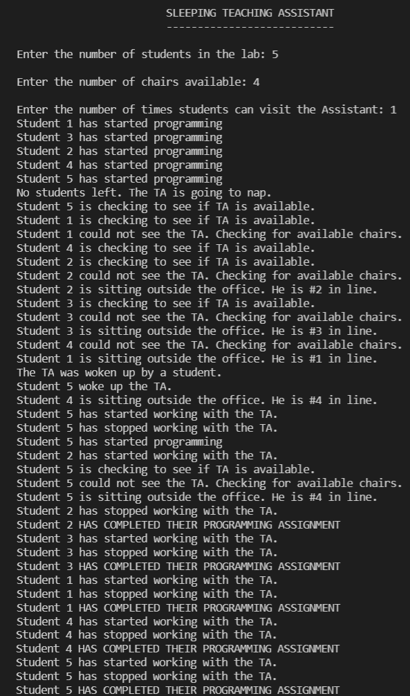

# Sleeping Teaching Assistant

## PROBLEM STATEMENT
The teaching assistant has to provide assistance to the undergraduate students during office hours with their programming difficulties. The teaching assistant office is just a single room with a table and chair. When the teaching assistant is busy in assisting one student the other students have to wait in the waiting area which is outside the office. If the chairs available in the waiting area are empty the the student can occupy it and wait for their chance. Also, if all the chairs are occupied then the student decides to come later.

After assisting a student, teaching assistant checks if there is any student present in the waiting area. If the students are present, then the teaching assistant assists the next student. If no one is present, the teaching assistant takes a nap. If any student arrives when the teaching assistant is taking the nap then, student have to wake up the teaching assistant for assistance.

From a technical point of view, this problem can be viewed as a critical section problem where each student is a process and the assistant's room is the critical section.
## OUTPUT

